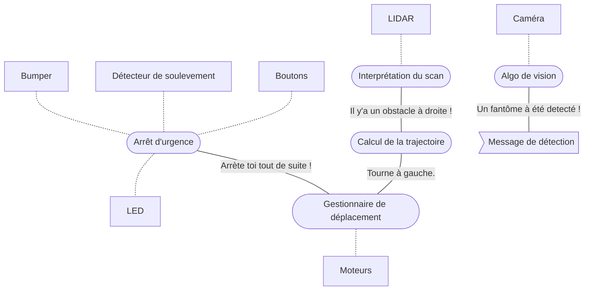

# Challenge 1 | `grp-pibot21-ch1`

**Ce package correspond au Challenge 1 de l'UV LARM.**

*Le but est de déplacer de manière aléatoire le robot dans l'arène. Celui-ci doit éviter les obstacles, tout en explorant l'ensemble de l'arène. Lorsqu'il voit un fantôme, il prévient via un message. Enfin, lorsque qu'un évenement anormal arrive (le robot fonce dans quelque chose, ou ne touche plus le sol) ou sur simple appui d'un bouton.*

## Utiliser le package

# Installation

Une fois qui vous avez cloné le repository, vous pouvez **supprimer les autres package** du repo, ils ne seront pas nécessaire pour ce challenge et cela accélerera le temps de build.

Ensuite, il vous assurez que votre ROS dispose de la liste suivante de package (vous pouvez voir la liste de vos packages ros en entrant ``)