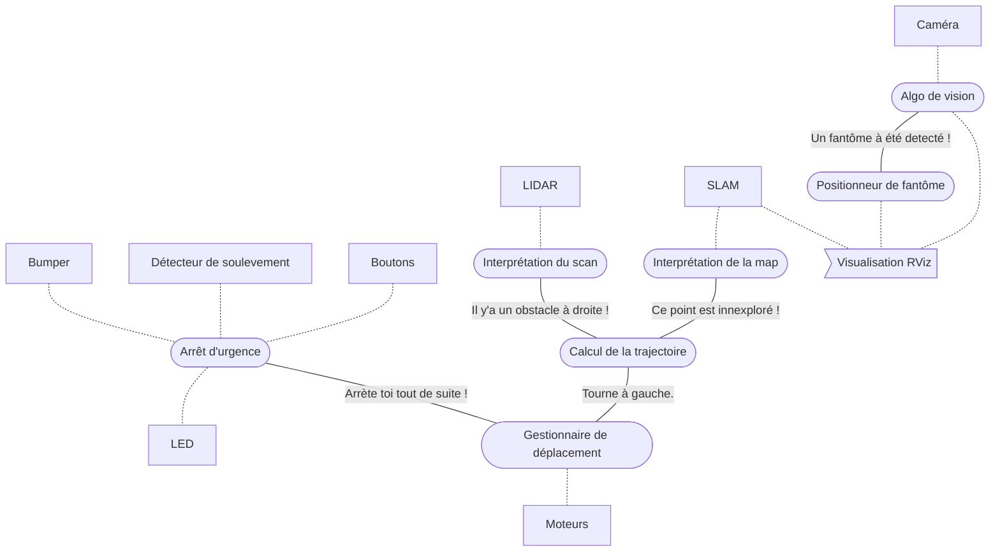

# Challenge 2 | `grp-pibot21-ch2`

**Ce package correspond au Challenge 2 de l'UV LARM.**

*Le but est de déplacer de manière intelligente dans l'arène. Celui-ci doit éviter les obstacles, tout en explorant l'ensemble de l'arène en allant vers les endroits inexplorés de préference. Lorsqu'il voit un fantôme, il enregistre la position de ce dernier et ne doit pas le réenergistrer si il est rencontré une seconde fois. Enfin, lorsque qu'un évenement anormal arrive (le robot fonce dans quelque chose, ou ne touche plus le sol) ou sur simple appui d'un bouton, le robot se stoppe.*



## Utiliser le package

### Installation

#### Cloner le repo

Pour installer les packages sur votre machine, **rendez vous dans votre ROS space** et **clonez ce repo** :

```console
git clone https://github.com/A3-M1/T-800.git
```

*Si vous le souhaitez, vous pouvez ensuite **supprimer les autres package** du repo, ils ne seront pas nécessaire pour ce challenge et cela accélerera le temps de build.*

#### Dépendances ROS

Ce package depend d'autres packages ROS pour fonctionner, vous pouvez **voir la liste des packages déjà installé** sur votre machine avec la commande :
```console
ros2 pkg list
```

Assurez vous d'avoir les packages suivants :
- [x] `rclpy`
- [x] `std_msgs`
- [x] `geometry_msgs`
- [x] `sensor_msgs`
- [x] `nav_msgs`
- [x] `rviz2`
- [x] `slam_toolbox`
- [ ] `kobuki_ros_interfaces`
- [ ] `tbot_sim`

> [!NOTE]
> Les packages cochés font souvent installé automatiquement lors de l'installation de ROS2

##### Si vous ne possedez pas `kobuki_ros_interfaces` :

Rendez vous dans votre ROS space et **entrez les commandes suivantes**.
```console
git clone https://github.com/imt-mobisyst/pkg-interfaces.git
colcon build --base-path pkg-interfaces
source ./install/setup.bash
```

##### Si vous ne possedez pas `tbot_sim` :

Aussi dans votre ROS space et **entrez les commandes suivantes**.
```console
git clone https://github.com/imt-mobisyst/pkg-tsim
colcon build
source ./install/setup.bash
```

#### Dépendances Python

Afin de vous assurez de posséder tous les modules Python nécessaires, **entrez la commande suivantes** depuis le dossier du projet.

```console
pip install -r grp-pibot21-ch2/requirements.txt
```

> [!TIP]
> Vous pouvez utiliser un environement virtuel Python pour éviter de modifier les versions des packages de votre installation locale de Python. *Voir la documentation : [venv — Creation of virtual environments](https://docs.python.org/3/library/venv.html).*

Le package est maintenand prêt !

### Build

Pour build le package, une fois cloné, **rendez vous simplment dans votre ROS space** et inscrivez les commandes suivantes :
```console
colcon build
source ./install/setup.bash
```

### Lancer le projet

